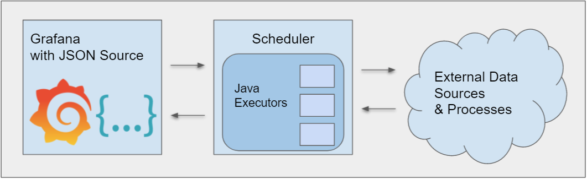
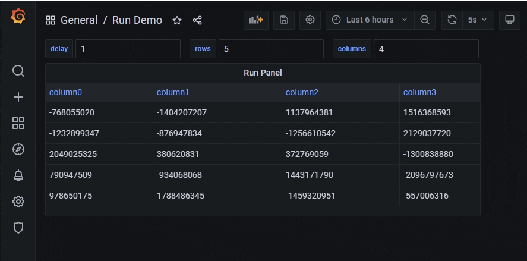
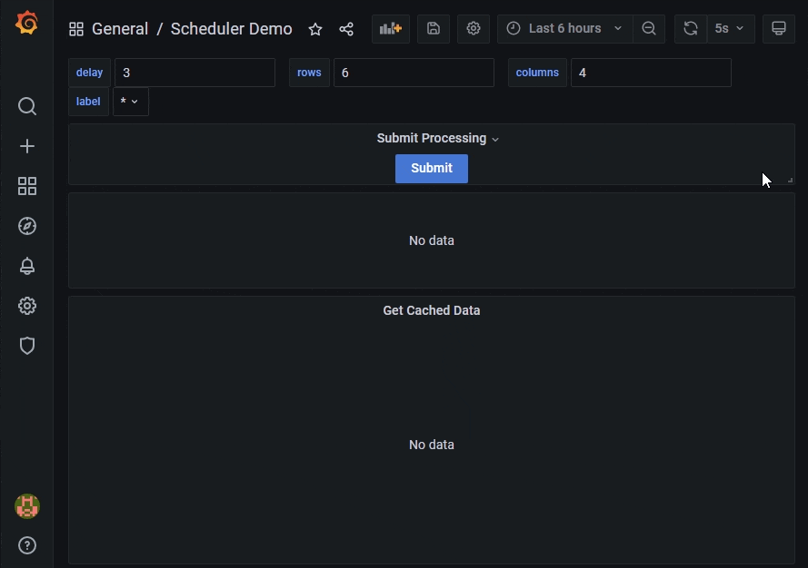
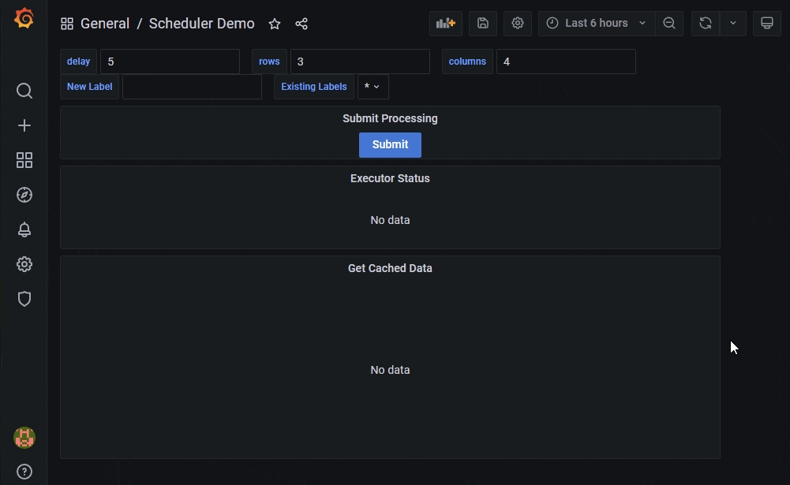

# Scheduler

## Overview 




* Grafana datasource for making sync or async calls to trigger ETL jobs.
    * Make sync call from Grafana to trigger a job and return a results
    * Make sync call from Grafana to schedule a longer running job. Poll the scheduler server for results
    * Can also be used to simply trigger resources 

* Scheduler is a java backend uses Executors to generate data to Grafana
    * Executors are isolated modules that only cares how to generate and produce data
    * There are hooks in place for implementation of custom executors (Java Development)
    * Request Manager Service handles queuing user requests

Scheduler current implementation includes two executors
* Process executor - trigger external script (for example python ETL script) and provide arguments from Grafana variables
* Uri executor - fetch data from external web api using GET calls
Scheduler is design to be extended with custom Java executors 








##Configuration:

*  Available configurations:

```properties
cacheTTLMins=60

cacheJdbcConfig.driver=com.mysql.jdbc.Driver
cacheJdbcConfig.url=jdbc:mysql://localhost:3306/databaseName?characterEncoding=latin1
cacheJdbcConfig.user=user
cacheJdbcConfig.password=password
cacheJdbcConfig.databaseName=databaseName

jobsConfigList[0].type=process
jobsConfigList[0].name=process1
jobsConfigList[0].config.process=/usr/bin/python
```

* To load your custom configurations, provide a path to your config file using command line:

```
--spring.config.location=file:///Users/home/config/jdbc.properties
```

* Configurations can be passed in as command line arguments.  This is usefull for testing or when you need to edit few conigurations. For example:

```
--cacheTTLMins=5
```

executor configurations are specific to each executor, see documentation for individual executors for available options

## Executors

Process

* About

* Security

* Configurations

UriExecutor

* About

* How output parsed

* Configurations

Creating Executor

* Which class to implement

* Adding factory bean configuration


