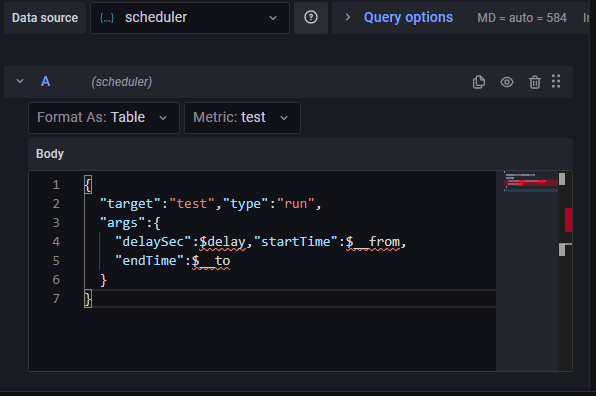
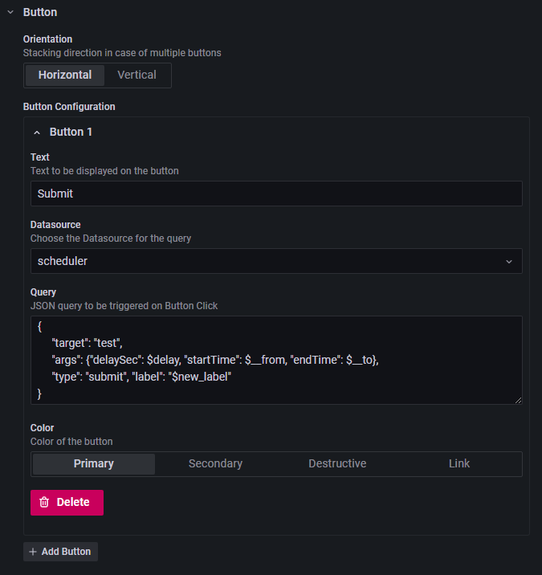
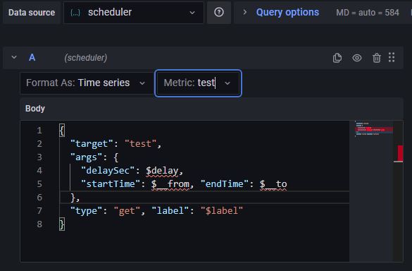

# Scheduler

## Overview 

Scheduler is a Grafana datasource that serves as a proxy for calling external processes or APIs.
  As the name implies, you can make async calls from Grafana to schedule a
  long-running process and then monitor the progress or
  fetch cached output at later time.

Scheduler is a Java backend that instantiates Executors.  Executors are modules callable from Grafana to
  produce data.  Other parts of the Scheduler handle queuing of the requests from Grafana and caching executors output.
  Currently, there are two build in executors:
  * Process executor - trigger external script (for example python ETL script) and provide arguments from Grafana variables
  * Uri executor - fetch data from external web api using GET calls
  
You can implement your own executor by extending Executor parent class and providing a factory bean to instantiate
  your custom Executor.


## Demo

**Run Requests**


Scheduler can be used to generate data instantly as a regular datasource using Run requests. 
Fill out available options, and your request will be instantly passed down to targeted executor. Configured panel will 
wait for the executor to produce output. For frequently updated data, you can 
turn on auto-refresh to continuously target an executor. This is a good use case for simple computations or 
querying external API. 
See details on the request form for more details.

**Submit Request**


Submit requests changes the way Grafana gets data from a data source. By adding Button Plugin to Grafana user can 
submit processing request asynchronously.
([My implementation of Grafana Button](https://github.com/ampx/grafana-json-button)) 
Once submitted, user can close out the page completely and fetch the results at later time.
Scheduler will cache the results for a configured amount of time.  
User can poll for completed data or progress status manually using data refresh button.
Alternatively user can enable auto-refresh to see progress change or to make data available immediately 
(Be cautious if you expect large data to be returned).

You can assign a unique label when submitting a new request  The labels can then be used to get status or cached data  
by selecting previously created label from a drop down option.  

*Alternative way to submit a job:*


Alternatively you can leave the label field blank and rely on arguments to fetch the results for previously submitted job.  
If a user submits a job and later another user tries to create a job with the same arguments, they will 
automatically see the results of a previous run.  
This is especially useful if you have a report that have default arguments, but you don't want triggered automatically.
Note that labeled and unlabeled requests are kept in a separate que.  
Meaning you would not be able to fetch results using arguments from previously submitted job with a label assigned to it.


##Configuration:

*  Configurations:

```properties
#cache cleanup policy
cacheTTLMins=60

#cache detail
cacheJdbcConfig.driver=com.mysql.jdbc.Driver
cacheJdbcConfig.url=jdbc:mysql://localhost:3306/databaseName?characterEncoding=latin1
cacheJdbcConfig.user=user
cacheJdbcConfig.password=password
cacheJdbcConfig.databaseName=databaseName

#executor instance configurations
jobsConfigList[0].type=process
jobsConfigList[0].name=process1
jobsConfigList[0].config.process=/usr/bin/python
```

* To load your custom configurations, provide a path to your config file using command line:

```
--spring.config.location=file:///Users/home/config/application.properties
```

* Configurations can be passed in as command line arguments.  This is useful for testing or when you need to edit 
  few configurations:

```
--cacheTTLMins=5
```

Each Executor implementation has specific configurations, see documentation for individual executors for available options

## Requests

**Request Parameters:**

* *target* - name of the executor instance being invoked. Select executor instance name from  either metric selection 
  drop-down or by explicitly specifying it in json body in query form. (Selection in json body will overwrite metric 
  selection)
* *args* - json object containing arguments for targeted executor
* *type* - Grafana sends all the queries to the same endpoint. So you have to explicitly provide the type of the 
  query as argument in json body
  * *run* - use this type if you want Grafana to wait for executor to finish working
  * *submit* - use this type if you want to submit a request to scheduler and have Grafana fetch results later
  * *get* - use this request type to fetch data from previously submitted request
* *source* - (optional) send dashboard name or other unique identifier for request source.  You can use source value to 
organize label requests from various sources.

## Working with Scheduler from Grafana:

**Run**

Create a new panel and select scheduler as the datasource.  Data for run request:

* Target executor instance name
* Executor arguments



**Submit**

Create a new panel and select Grafana Button as panel type.  Set scheduler as datasource for button.  Data for submit
request:

* Target executor instance name
* Arguments passed to executor
* User defined label for submitted request (Optional parameter).  Scheduler will ignore label names with empty string or 
wild card

For submit requests we create a panel to submit data processing request - it will not produce any data.



**Get**

Create a new panel and select scheduler as the datasource.  Data for run request:




## Executors

**Process Executor** - Start external process from Scheduler

* Executor name - *process*

* Configurations
  * *process* - external process to b
  * *argSet* - list of process arguments allowed from Grafana
  * *fixedArgs* - constant list of process arguments passed that are passed on every request
  * *homeDir* - home directory for process execution
  * *envVars* - set environment variable before running process


**Rest Executor** - Get data from external API. Array returned by external server will be converted into a table,
object into a row. Top level objects are converted into cells, nested objects will be in parents cell.

* Executor name - *rest*

* Configurations
  * *argSet* - list of process arguments allowed from Grafana
  * *fixedArgs* - constant list of process arguments passed that are passed on every request

**Custom Executors** - Create your own executor by creating a class that extends Executor abstract class. There are two 
ways to add your executor to executor factory:

* Update Scheduler source code and build it yourself - update createExecutor method in ExecutorManager.

* Add Scheduler library to your own project. You will need to add Spring Bean configuration that creates instance of 
your implementation of ExecutorManager.  Your implementation will need to implement createExecutor method.
