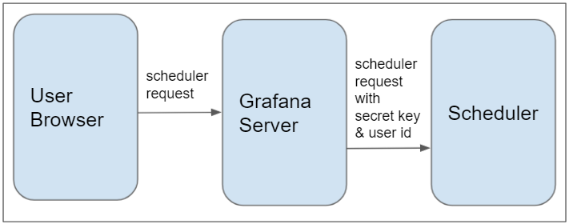

# Scheduler
* [Overview](#overivew)
* [Executors](#executors)
* [Install & Run](#install--run)
* [Configure](docs/config.md)
* [Examples](docs/examples.md)
* [Security](#security)
* [WebApi](docs/api.md)

## Overview 

Scheduler is Grafana proxy datasource for calling external processes or APIs.
  As the name implies, you can make async calls from Grafana to schedule a
  long-running process and then monitor the progress and
  fetch cached output at later time.

Executors are computational modules of the Scheduler. Executors are callable from Grafana to
  produce data.  Other parts of the Scheduler handle queuing of the requests from Grafana and caching executors output.
  Currently, there are two build in executors:
  * Process executor - trigger external script (for example python ETL script) and provide arguments from Grafana variables
  * Rest executor - fetch data from external web api using GET calls
  
You can implement your own executor by extending Executor parent class and providing a factory bean to instantiate
  your custom Executor.

## Executors

**Process Executor** - Start external process from Scheduler

**Rest Executor** - Get data from external API. Array returned by external server will be converted into a table,
object into a row. Top level objects are converted into cells, nested objects will be in parents cell.

**Custom Executors** - Create your own executor by creating a class that extends Executor abstract class. You will need 
to add your executor to Executor Factory by adding the logic to createExecutor method in ExecutorManager.

## Install & Run

Get latest build from [Github](https://github.com/ampx/Scheduler/releases)

## Security

Scheduler uses shared secret key to secure communication with Grafana Server. User identity is passed in as a header 
from Grafana Backend server. 

