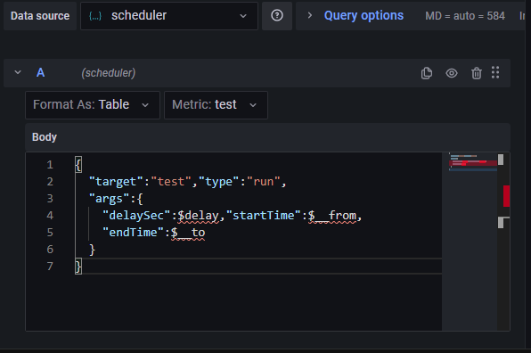
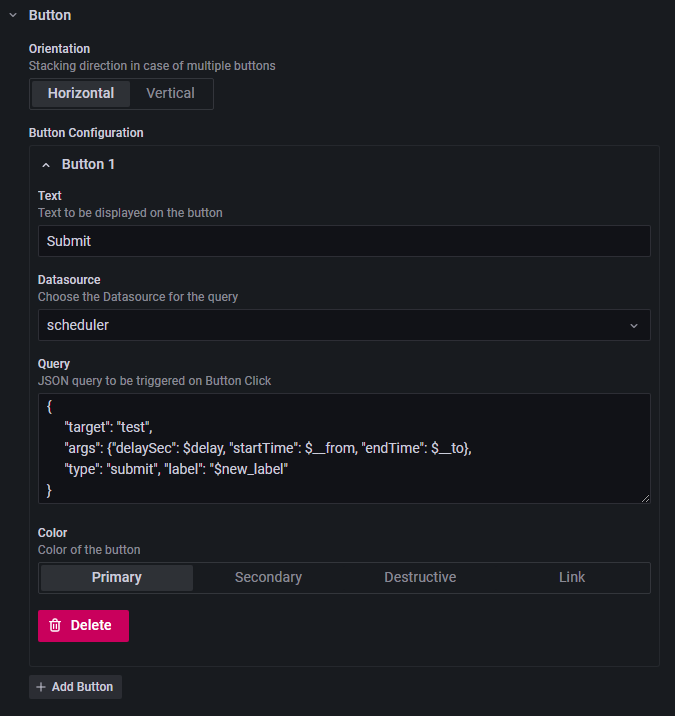

## Demo

**Run Requests**

Scheduler can be used to generate data instantly as a regular datasource using Run requests.
Fill out available options, and your request will be instantly passed down to targeted executor. Configured panel will
wait for the executor to produce output. For frequently updated data, you can
turn on auto-refresh to continuously target an executor. This is a good use case for simple computations or
querying external API.
See details on the request form for more details.

**Submit Request**

Submit requests changes the way Grafana gets data from a data source. By adding Button Plugin to Grafana user can
submit processing request asynchronously.
([My implementation of Grafana Button](https://github.com/ampx/grafana-json-button))
Once submitted, user can close out the page completely and fetch the results at later time.
Scheduler will cache the results for a configured amount of time.  
Using Get requests user can poll for completed data or progress status manually using data refresh button.
Alternatively user can enable auto-refresh to see progress change or to make data available immediately
(Be cautious if you expect large data to be returned).

There are two methods to retrieve submitted request status or to get completed results.  First you can assign a unique
label when submitting a new request.  The labels can then be used to get status or cached data  
by selecting previously created label from a drop down option.

*Alternative way to submit a job:*

Alternatively you can leave the label field blank and rely on arguments to fetch the results for previously submitted job.  
If a user submits a job and later another user tries to create a job with the same arguments, they will
automatically see the results of a previous run.  
This is especially useful if you have a report that have default arguments, but you don't want triggered automatically.
Note that labeled and unlabeled requests are kept in a separate que.  
Meaning you would not be able to fetch results using arguments from previously submitted job with a label assigned to it.

## Requests

**Request Parameters:**

* *target* - name of the executor instance being invoked. Select executor instance name from  either metric selection
  drop-down or by explicitly specifying it in json body in query form. (Selection in json body will overwrite metric
  selection)
* *args* - json object containing arguments for targeted executor
* *type* - Grafana sends all the queries to the same endpoint. So you have to explicitly provide the type of the
  query as argument in json body
    * *run* - use this type if you want Grafana to wait for executor to finish working
    * *submit* - use this type if you want to submit a request to scheduler and have Grafana fetch results later
    * *get* - use this request type to fetch data from previously submitted request
* *source* - (optional) send dashboard name or other unique identifier for request source.  You can use source value to
  organize label requests from various sources.

## Working with Scheduler from Grafana:

**Run**

Create a new panel and select scheduler as the datasource.  Data for run request:

* Target executor instance name
* Executor arguments

**Submit**

Create a new panel and select Grafana Button as panel type.  Set scheduler as datasource for button.  Data for submit
request:

* Target executor instance name
* Arguments passed to executor
* User defined label (Optional parameter).  Scheduler will ignore label names with empty string or
  wild card

**Get**

Create a new panel and select scheduler as the datasource.  Data for run request:

* Target executor instance name
* Arguments passed to executor (Optional if labels are not used)
* User defined label (Optional if arguments are not used).  Scheduler will ignore label names with empty string or
  wild card

